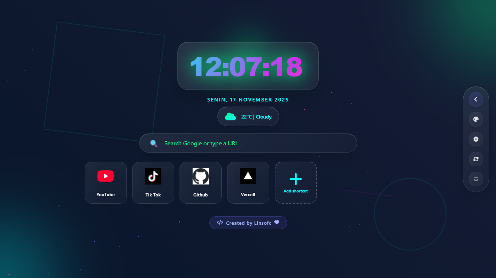
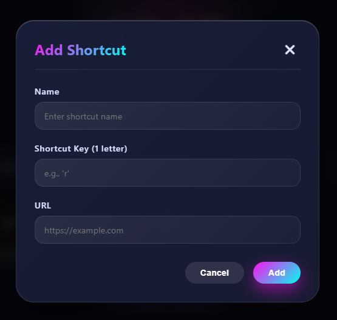

# Interactive Startpage
Startpage interaktif menggunakan HTML, CSS, dan JavaScript  cocok untuk homepage browser, dashboard pribadi, dan tampilan minimalis.

<div align="center">



# Linsofc Start Page

**Dashboard pribadi (Start Page) yang modern, estetik, dan highly-customizable.**
<br>
*Dibangun dengan HTML, CSS, dan Vanilla JavaScript.*

[](https://github.com/Linsofc/interactive-startpage/blob/main/LICENSE)
[](https://github.com/Linsofc/interactive-startpage/graphs/commit-activity)
[](https://github.com/Linsofc/interactive-startpage)


</div>

## Fitur Utama

| Fitur | Deskripsi |
| :--- | :--- |
| **Multi-Tema** | Tersedia **16+ Tema** (Cyberpunk, Neon, Nature, Galaxy, dll). |
| **Widget Cuaca** | Deteksi lokasi otomatis & info cuaca real-time dengan animasi. |
| **Quick Access** | Tambahkan shortcut link favorit Anda dengan pengambilan ikon otomatis. |
| **Smart Search** | Search bar yang terintegrasi langsung dengan Google. |
| **Kustomisasi** | Atur kecepatan animasi, efek partikel, dan format waktu (12h/24h). |
| **Responsif** | Tampilan sempurna di Desktop, Tablet, dan Mobile. |

<br>

<div align="center">
  <h3>Screenshot: Menambahkan Shortcut</h3>
  
</div>

<br>

---

## Instalasi & Penggunaan

Ikuti langkah-langkah berikut untuk menjadikan Linsofc Start Page sebagai beranda browser Anda.

### 1️⃣ Langkah Pertama: Persiapan File

1.  **Download Source Code**
    Klik tombol di bawah untuk mengunduh versi terbaru:
    <div align="center">
      <br>
      <a href="https://github.com/Linsofc/interactive-startpage/archive/refs/heads/main.zip">
        
      </a>
      <br><br>
    </div>

2.  **Ekstrak File**
    Ekstrak file `.zip` yang baru saja diunduh ke lokasi yang aman (misal: `D:\`).

3.  **Salin Path File**
    * Masuk ke folder hasil ekstrak.
    * Klik kanan pada file `index.html`.
    * Pilih **"Copy as path"**.

    > **Contoh hasil copy:**
    > ```bash
    > "D:\interactive-startpage\index.html"
    > ```

---

### 2️⃣ Langkah Kedua: Mengatur Startup Chrome

Agar halaman ini terbuka otomatis saat Chrome dijalankan:

1.  Buka **Google Chrome**.
2.  Masuk ke **Settings** (Pengaturan) `⋮` > `Settings`.
3.  Pilih menu **On startup** di sidebar kiri.
4.  Pilih opsi **Open a specific page or set of pages**.
5.  Klik **Add a new page**.
6.  Tempel (Paste) path yang sudah Anda copy tadi.

    ⚠️ **PENTING:** Hapus tanda kutip `"` di awal dan akhir path.

    **Format yang benar:**
    ```text
    D:\interactive-startpage\index.html
    ```
7.  Simpan, tutup Chrome sepenuhnya, lalu buka kembali.

---

### 3️⃣ Opsional: Tampilan di "New Tab"

Jika Anda ingin tampilan ini muncul setiap kali Anda membuka **Tab Baru (+)**, gunakan ekstensi tambahan.

1.  **Instal Ekstensi**
    Pasang [**New Tab Redirect**](https://chromewebstore.google.com/detail/new-tab-redirect/icpgjfneehieebagbmdbhnlpiopdcmna) dari Chrome Web Store.

2.  **Konfigurasi Ekstensi**
    * Setelah terinstal, klik ikon ekstensi dan pilih **Extension options**.
    * **Wajib:** Pastikan Anda mengizinkan akses file lokal. Pergi ke `Manage Extensions` > Cari New Tab Redirect > Aktifkan **"Allow access to file URLs"**.

3.  **Set Redirect URL**
    Pada kolom Redirect URL, masukkan path file Anda dengan format protokol file:
    
    Tambahkan `file:///` di depan path Anda.

    **Contoh Format:**
    ```text
    file:///D:/interactive-startpage/index.html
    ```
    *(Perhatikan penggunaan garis miring `/` atau `\` tergantung OS, namun Chrome biasanya menerima keduanya jika diawali file:///)*

<br>

<div align="center">

**Selesai! Nikmati tampilan baru browser Anda.**
<br>
<a href="https://www.youtube.com/@LinsOfficiall"></a>

</div>
#interactive-startpage #Linsofc